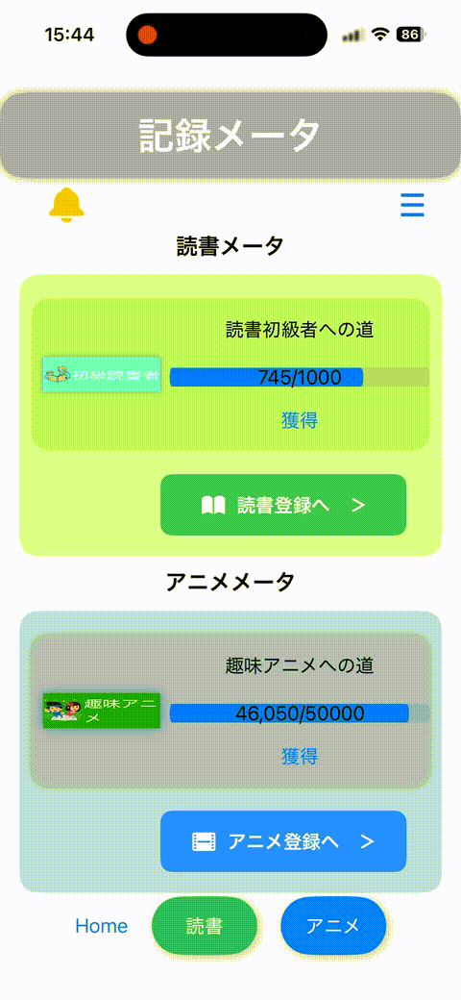
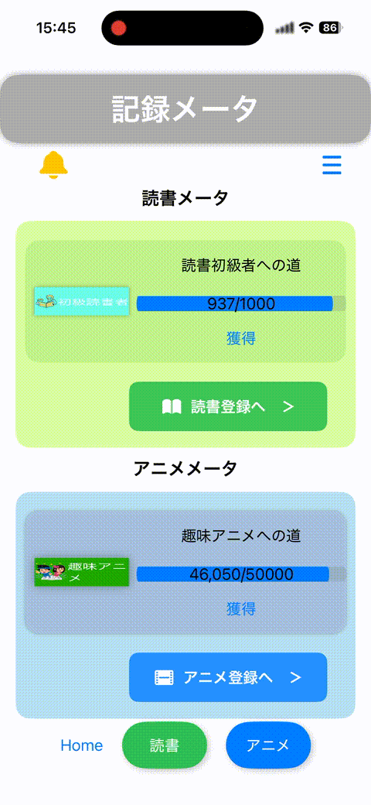

<h2>読書・アニメ記録アプリ「麺録」</h2>

  
    &nbsp;&nbsp;&nbsp;
  
  &nbsp;&nbsp;&nbsp;
  

Swift / SwiftUI を用いて、読書とアニメ視聴の体験を記録・比較できるiOSアプリとして開発した。

機能概要
読書・アニメ作品の記録（タイトル、感想、評価など）
記録の一覧表示・詳細表示
ジャンル（読書 / アニメ）別の管理およびフィルタリング
感想の投稿機能（簡易SNS形式）
投稿時に、読書とアニメの感想を関連付けて登録できる機能
コンセプト

本アプリのコア機能は「異なるメディア（読書とアニメ）の体験を横断して振り返ること」にある。
単なる記録ではなく、各体験を感想単位で紐づけることで、共通点や差異を後から比較・解釈できる構造を目指している。

データ管理
Realm を用いたローカルデータの永続化
SNS的な投稿構造を意識したデータ設計
将来的な拡張として Firestore によるクラウド同期・共有機能も想定
技術構成
Swift / SwiftUI
Realm（ローカルDB）
Firestore（設計拡張想定）
